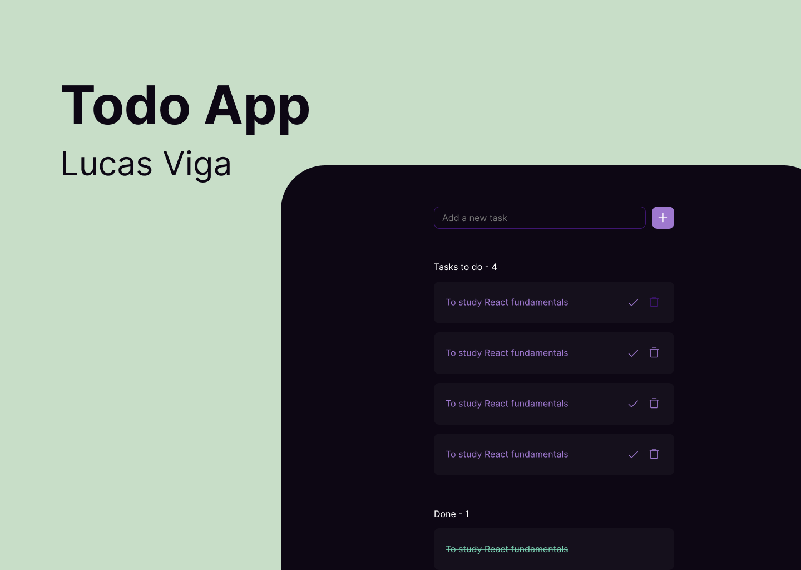

# Flask Beginner Project



[Credit to Figma Design](https://www.figma.com/design/sj82xlSgHUy0fHKH0y9Wbv/Todo-App-(Community)?node-id=102-145&t=dvfJjA8FhQTkojhI-0)
=>
[View the final result]()

---

## 🧾 Instruction:

1. Clone the repository.

```
git clone https://github.com/DaniilKalts/flask-todo-list.git
```

2. (Optional) Create and Activate a Virtual Environment.

- On Windows:
  - ```
    python -m venv .venv
    .venv\Scripts\activate
    ```
- On macOS/Linux:
    - ```
      python3 -m venv .venv
      source .venv/bin/activate
      
3. Install dependencies.

```
pip install -r requirements.txt 
```

4. Run the project.

```
python main.py 
```

---

### Inspired by - Josh Wenner🔥

[Credit for the Flask CRUD application by Josh Wenner](https://github.com/Joshwen7947/flask-crud-application)

👇

[Watch the full tutorial on YouTube](https://www.youtube.com/watch?v=45P3xQPaYxc&list=LL&ab_channel=CodewithJosh)
